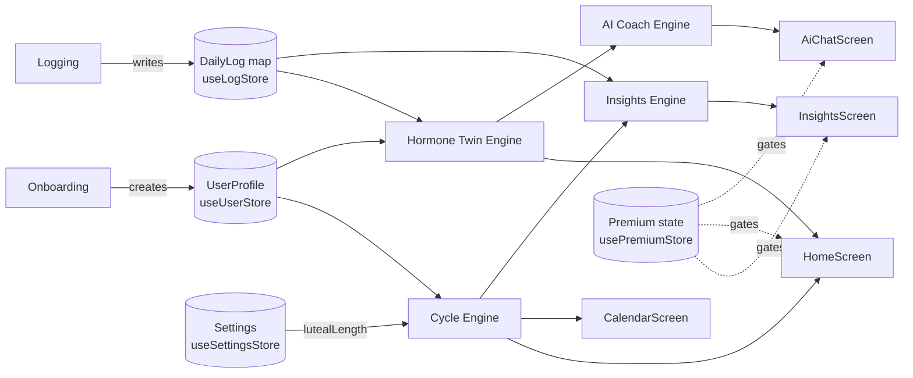

# 02 — Business Domain Map

All findings **Confirmed from code** unless tagged otherwise. Source: `src/services/**`, `src/store/**`, `src/types/**`, `src/features/**`.

## 2.1 Domain: Cycle Tracking (period / ovulation prediction)
- **Business goal**: Predict cycle day, phase, next period, fertile window, ovulation date, PMS window from one self-reported reference cycle.
- **Users**: All users, free tier included.
- **Inputs**: `UserProfile.lastPeriodStartDate`, `averageCycleLength`, `averagePeriodLength`, current date, optional `lutealLength` from Settings.
- **Outputs**: `CyclePrediction` (cycle day, phase, next period date, days-until-period, fertile window, ovulation estimate, PMS window, confidence score 0.7/0.8).
- **Business rules**: see `03-business-rules.md` §1 (cycleEngine table).
- **Display conditions**: Renders on Home hero and Calendar for any user with a completed profile; `HomeScreen`/`CalendarScreen` return `null` (no fallback UI) if `!profile`.
- **Side effects**: None (pure computation, nothing persisted).
- **Error state**: None implemented — no try/catch around date math.
- **Empty state**: N/A (always computable once a profile exists).
- **Loading state**: None (synchronous).
- **Premium restriction**: **None** — fully free.
- **Files**: `src/services/cycleEngine.ts` (+`.test.ts`), `src/features/cycle/useCycleToday.ts`, `src/features/home/HomeScreen.tsx`, `src/components/cycle/*`.

## 2.2 Domain: Hormone Twin (daily wellness snapshot)
- **Business goal**: Produce a daily synthetic energy/mood/focus/pain/PMS-probability snapshot plus a composite "Hormone Twin Score" and localized coach/food/workout/self-care tips, from a phase-based lookup table nudged by the user's own recent self-reported levels.
- **Users**: All users (scores), premium users (the derived "Plan" tips card on Home).
- **Inputs**: `UserProfile`, up to 3 most recent `DailyLog`s before the date, optional `lutealLength`.
- **Outputs**: `HormoneTwinDailyProfile` (5 scores 0-100 + i18n tip keys, resolved to copy via `t()` at render time, not literal strings).
- **Business rules**: see `03-business-rules.md` §1 (hormoneTwinEngine table). **This is not measured biometric data** — it is a hand-picked lookup table (`PHASE_SCORES`/`PMS_SCORES`) adjusted by a bounded shift from self-reported 1-10 sliders.
- **Display conditions**: Today's scores shown to everyone on Home; the "Plan" tips card is premium-gated (`HomeScreen.tsx:199-212`).
- **Side effects**: None (pure computation).
- **Error/Empty/Loading state**: None implemented; not applicable to a synchronous pure function.
- **Premium restriction**: Plan/tips card only — see `11-monetization-analytics-notification.md`.
- **Files**: `src/services/hormoneTwinEngine.ts` (+`.test.ts`).

## 2.3 Domain: Insights / Scoring
- **Business goal**: Aggregate the user's own logged history into simple stats — symptom frequency ranking, average energy/sleep per cycle phase, PMS-vs-non-PMS sleep comparison, a "regular"/"variable" cycle-regularity label.
- **Users**: All users see the summary card; premium users see the detail cards.
- **Inputs**: `UserProfile`, all `DailyLog`s, optional `lutealLength`.
- **Outputs**: `Insights` object (log count, avg cycle length, confidence score, top 3 symptoms, per-phase averages, PMS/other sleep averages, next PMS window).
- **Business rules**: see `03-business-rules.md` §1 (insightsEngine table). **Flag**: `computeInsights` reads `new Date()` internally rather than accepting `today` as a parameter (`insightsEngine.ts:80`), unlike its sibling engines — a hidden wall-clock dependency and testability/determinism gap.
- **Display conditions**: Requires `MIN_LOGS = 3` logged days; below that, `InsightsScreen` shows an explicit `EmptyState` (Luna mascot, "thinking" expression) instead of the summary.
- **Premium restriction**: Energy-by-phase, sleep, PMS-window, and top-symptoms cards are locked behind `!isPremium` via `LockedCard`/`withLock`; the summary card (cycle length/regularity) is free.
- **Files**: `src/services/insightsEngine.ts` (+`.test.ts`), `src/features/insights/InsightsScreen.tsx`.

## 2.4 Domain: AI Coach / Chat
- **Business goal**: Answer free-text questions and generate a post-log "reflection" message, styled as an AI assistant.
- **Important — Confirmed from code**: **This is not a real LLM/AI.** It is a deterministic, offline, keyword-intent classifier (`detectIntent`) that composes 3 fixed i18next string keys (`ai.answer.<intent>`, `ai.why.<phaseGroup>`, `ai.try.<intent>.<variant>`) based on the matched intent and current cycle phase. No network call, no model, no API key, nothing non-deterministic. A hardcoded `600ms` `setTimeout` (`useChat.ts:15,47`) simulates "typing" latency purely for UX effect.
- **Users**: All users, capped at `FREE_AI_QUESTIONS_PER_DAY = 3` for free tier; unlimited for premium.
- **Inputs**: user's typed question (or a `SuggestedPrompts` chip tap), `UserProfile`, `CyclePrediction`, `HormoneTwinDailyProfile`, recent logs.
- **Outputs**: `{ text, includesDisclaimer }` — a joined localized string; a medical disclaimer line is appended when the matched intent is health-related (`HEALTH_INTENTS`).
- **Business rules**: see `03-business-rules.md` §1 (aiCoachEngine table).
- **Display conditions**: Empty chat panel shown when `messages.length === 0`; `TypingDots` shown while the simulated response is "composing".
- **Side effects**: None persisted — `ChatMessage[]` lives in local component state (`useState` in `useChat.ts:24`), **not saved to any store**, so chat history is lost on screen unmount/app restart.
- **Error state**: None implemented (no failure path exists since there's no real network call).
- **Premium restriction**: Daily question cap; exceeding it redirects to `/paywall` before the message is even added to the chat (`useChat.ts:33-36`).
- **Files**: `src/services/aiCoachEngine.ts` (+`.test.ts`), `src/features/ai/useChat.ts`, `src/features/ai/AiChatScreen.tsx`.

## 2.5 Domain: Symptom / Daily Logging
- **Business goal**: Let the user record one `DailyLog` per calendar day (flow, symptoms, moods, energy/sleep/stress 1-10 sliders, workout type, free-text note), feeding the Hormone Twin and Insights engines.
- **Users**: All users, unlimited.
- **Inputs**: form state in `LogScreen.tsx`.
- **Outputs**: a `DailyLog` keyed by ISO date, saved via `useLogStore.saveLog`, plus an immediate "reflection" string.
- **Business rules**: One log per calendar date — a `Record<string, DailyLog>` keyed by `date` — so a second save the same day **overwrites** (does not append). No numeric bounds enforced in the type itself on the 1-10 sliders (UI-level `LevelSlider` component presumed to clamp — **Unclear / requires confirmation**, component not read).
- **Display conditions**: Pre-fills from the existing log for "today" if one exists.
- **Side effects**: Success haptic + "saved" pill + AI reflection card fade-in on save.
- **Premium restriction**: **None** — logging is fully free.
- **Files**: `src/features/log/LogScreen.tsx`, `src/store/useLogStore.ts`, `src/types/log.ts`.

## 2.6 Domain: Premium / Paywall
- **Business goal**: Gate select screens/sections, cap free AI usage, present a 3-slide story + monthly/yearly plan picker, and simulate a purchase.
- **Business rules & full funnel**: see `11-monetization-analytics-notification.md`.
- **Files**: `src/store/usePremiumStore.ts`, `src/types/premium.ts`, `src/components/paywall/PremiumBanner.tsx`, `src/features/paywall/PaywallScreen.tsx`.

## 2.7 Domain: Onboarding
- **Business goal**: Collect the initial `UserProfile` (nickname, email, cycle stats, goals, symptom history) across a fixed 6-step wizard, held in an unpersisted in-memory draft store, committed to the persisted `useUserStore` on completion.
- **Business rules**: `averageCycleLength` defaults to 28, `averagePeriodLength` defaults to 5 in the draft; validated against zod schemas (20-45 / 2-10 respectively — note the onboarding form's own inline `Stepper` bounds are 21-40/2-10 per the navigation audit, a **narrower** range than the validation schema's 20-45 — worth reconciling, see `03-business-rules.md`).
- **Premium restriction**: None.
- **Files**: `src/features/onboarding/useOnboardingDraft.ts`, `src/store/useUserStore.ts`, `src/types/user.ts`, `src/utils/validation.ts`, full flow in `04-user-flows.md`.

## 2.8 Domain: Settings
- **Business goal**: Notification toggles (UI-only — no scheduling logic found), `lutealLength` (feeds cycle engine, clamped 10-16), units, theme, language, subscription management entry point, "Delete all data", and a **dev-only premium override toggle** (see risk register).
- **Files**: `src/store/useSettingsStore.ts` (+`.test.ts`), `src/features/settings/SettingsScreen.tsx`, `src/store/index.ts` (`resetAllData`).

## Domain relationship diagram

See `03-business-rules.md` for the full rules inventory and data model, and `11-monetization-analytics-notification.md` for the monetization funnel.
