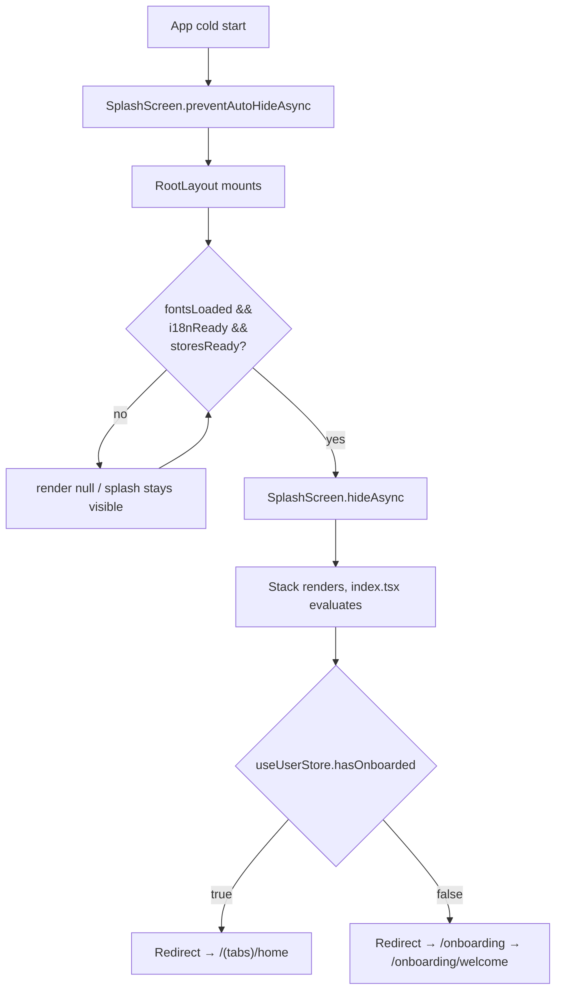

# 04 — User Flows

All findings **Confirmed from code** unless tagged otherwise. See `05-navigation-map.md` for the full route tree.

## 1. App Launch Flow

| Step | File:line | Logic |
|---|---|---|
| Prevent auto-hide splash | `src/app/_layout.tsx:18` | `SplashScreen.preventAutoHideAsync()` at module scope |
| Store hydration gate | `src/app/_layout.tsx:20-52` | `useStoresHydrated()` polls `persist.hasHydrated()` for all 4 persisted stores; subscribes via `persist.onFinishHydration` |
| Font loading | `src/app/_layout.tsx:56-62` | `useFonts()` — Cormorant Garamond + Manrope weights |
| i18n init | `src/app/_layout.tsx:55,66-68` | `initI18n()` (async), sets `i18nReady` in `.finally()` — so an i18n init failure still unblocks the app |
| Combined ready gate | `src/app/_layout.tsx:70` | `ready = i18nReady && storesReady && fontsLoaded` |
| Hide splash | `src/app/_layout.tsx:72-74` | `useEffect` → `SplashScreen.hideAsync()` once `ready` |
| Not-ready render | `src/app/_layout.tsx:76` | `if (!ready) return null;` — **no loading UI**, blank behind the still-visible native splash |
| Root Stack registration | `src/app/_layout.tsx:81-94` | `index`, `onboarding`, `(tabs)`, `settings`, `paywall`, with per-route fade animations; `paywall` is `presentation: 'modal'` |
| Onboarding-completion branch | `src/app/index.tsx:5-11` | `hasOnboarded` read from `useUserStore` → `<Redirect>` to `/(tabs)/home` or `/onboarding` |

**Error fallback**: No error boundary or `componentDidCatch` exists anywhere in `src/app` or `src/features` — any render-time exception has no fallback UI. **Unclear / requires confirmation**: whether a corrupt-`AsyncStorage` read would hang the hydration gate forever (Zustand-internal behavior, not explicitly caught here).



## 2. Authentication Flow

**Confirmed: there is no authentication system.** No sign-up, sign-in, guest mode, OTP, forgot-password, social login, token refresh, or session-expiry logic exists anywhere in the codebase. The only related UI is a disabled "Sign in with Apple" button on the final onboarding screen (`src/app/onboarding/account.tsx:102-106`) that shows `Alert.alert(t('onboarding.account.appleSoon'))` — a placeholder, not implemented. The app is fully local/anonymous; identity is just a locally-generated `UserProfile` with no server-verified account behind it.

## 3. Onboarding Flow

Fixed linear order via explicit `router.push` calls — **no dynamic skip logic and no skip affordance on any screen**. Draft data lives in an **unpersisted, in-memory** store `useOnboardingDraft` (`src/features/onboarding/useOnboardingDraft.ts:37-43`), separate from the persisted `useUserStore`.

| # | Screen | Header step | Collects | Validation | Continue target |
|---|---|---|---|---|---|
| 0 | `onboarding/index.tsx` | — | n/a | n/a | Immediate `<Redirect href="/onboarding/welcome" />` |
| 1 | `welcome.tsx` | none | none | none | CTA → `/onboarding/disclaimer` |
| 2 | `disclaimer.tsx` | none | none | none | CTA → `/onboarding/cycle-basics` |
| 3 | `cycle-basics.tsx` | 1/4 | `averageCycleLength` (Stepper 21-40), `averagePeriodLength` (Stepper 2-10), `lastPeriodStartDate` | Continue `disabled={!draft.lastPeriodStartDate}` — length fields always have defaults so only the date truly gates | → `/onboarding/goals` |
| 4 | `goals.tsx` | 2/4 | `goals: Goal[]` (6 options, staggered chip entrance) | `disabled={draft.goals.length === 0}` | → `/onboarding/symptoms` |
| 5 | `symptoms.tsx` | 3/4 | `symptoms: Symptom[]` (chip toggle) | none — 0 symptoms allowed | → `/onboarding/account` |
| 6 | `account.tsx` | 4/4 | `nickname`, `email` | zod `nicknameSchema`/`emailSchema`; errors shown only after first submit attempt (`touched`) | See "Completion" below |

**Back behavior**: `OnboardingStepHeader`'s back button calls `router.back()` on steps 1-4 (cycle-basics through account). **Welcome and Disclaimer have no in-app back button** — only hardware/gesture back.

**Completion** (`account.tsx:28-48`, function `finish`):
1. Validate name+email; block if invalid.
2. Build `UserProfile` from draft + computed `lastPeriodEndDate = addDaysISO(start, periodLength - 1)` + `symptomHistory: draft.symptoms`.
3. `setProfile(profile)` → `useUserStore.setProfile`.
4. `completeOnboarding()` → sets `hasOnboarded: true`.
5. `draft.reset()` clears the in-memory draft.
6. `router.replace('/(tabs)/home')` — replace, not push, so onboarding isn't in back history.

```mermaid
flowchart LR
    W[welcome] -->|CTA| D[disclaimer]
    D -->|CTA| C["cycle-basics (1/4)"]
    C -->|CTA, requires date| G["goals (2/4)"]
    G -->|CTA, ≥1 goal| S["symptoms (3/4)"]
    S -->|CTA, optional| A["account (4/4)"]
    A -->|valid name+email| Done[completeOnboarding + setProfile]
    Done --> Home["router.replace '/(tabs)/home'"]
    C -. router.back .-> G
    G -. router.back .-> S
    S -. router.back .-> A
```

## 4. Feature Flows

### 4.1 Cycle prediction (Home / Calendar)
Entry: profile exists → `useCycleToday`/`getCyclePrediction` run synchronously → rendered on Home hero and Calendar month grid. No loading/error state (pure sync computation). See `02-business-domain.md` §2.1.

### 4.2 Daily logging
Entry: Log tab or a Home quick action or `DayDetailSheet`'s "log today" CTA (only offered for **today**, `DayDetailSheet.tsx:73-82`) → `LogScreen` pre-fills from any existing log for today → user edits sliders/chips/note → "Save" → `useLogStore.saveLog` (sync, local) → success haptic + "saved" pill + AI reflection card fade-in. No network step, so no loading/error UI is needed or present.

### 4.3 AI Coach chat
Entry: AI tab or Home "Ask AI" buttons → user types or taps a suggested prompt → `useChat.send`: if `!canAskAi()` (free cap exhausted), **redirect to `/paywall` before the message is added** → else append user message, set `typing=true`, `setTimeout(600ms)` → append coach reply from `generateAIResponse` → `typing=false`. No persistence of chat history.

### 4.4 Insights
Entry: Insights tab → `computeInsights` runs → if `logCount < 3`, `EmptyState` shown instead → else summary card (free) + 4 detail cards (premium-gated, each independently wrapped in `LockedCard`) → tapping a locked card's unlock pill routes to `/paywall`.

### 4.5 Paywall / purchase (see `11-monetization-analytics-notification.md` for full funnel detail)
Entry points: Home `PremiumBanner`, Insights locked-card CTA, Settings "Upgrade"/"Manage", AI chat quota exhaustion. Flow: 3-slide story → plan picker (monthly/yearly; `'lifetime'` exists in the type but has no UI) → "Subscribe" → `purchase()` (local mock, cannot fail, no loading state) → success haptic → `router.back()`. "Restore Purchases" is a documented no-op.

### 4.6 Settings / account management
- **Sign out** (`onSignOut`): `useUserStore.signOut()` sets `hasOnboarded: false` **only** — `profile` itself is not cleared — then `router.dismissAll()` + `router.replace('/onboarding')`. No confirmation dialog.
- **Delete all data** (`onConfirmDelete`, two-step confirm UI): `resetAllData()` resets all 4 stores, then same redirect.
- **Export data**: sets a flash "success" message (`exportReady`) but performs **no actual export/share action** — confirmed UI stub.
- Inline profile edits (nickname/email, cycle/period/luteal length, last period date), notification toggles (UI-only, no scheduling logic found), units/theme/language.

## 5. Edge Cases (Confirmed from code)

| Case | Evidence |
|---|---|
| New user, no profile | `profile` defaults `null`, `hasOnboarded` defaults `false` → routed to onboarding |
| Returning user | `hasOnboarded: true` persisted → straight to `/(tabs)/home`, onboarding entirely skipped |
| Onboarding abandoned mid-flow (app killed) | Draft is not persisted → all progress lost; restarts from `welcome` next launch |
| Screens with no profile | `HomeScreen`, `CalendarScreen`, `InsightsScreen`, `SettingsScreen` all `return null` defensively — **no spinner or empty-state UI**, just blank |
| Post-sign-out inconsistent state | `signOut()` clears `hasOnboarded` but **not** `profile` — if a user were routed back into `(tabs)` after signing out (not normally reachable via UI, but not structurally prevented either), screens would render with the stale profile rather than blank |
| Rehydration after force-quit | Blocked on `useStoresHydrated()` until all 4 stores report hydrated |
| Deep linking | `app.json` scheme `"dialuna"`; **no custom `Linking` handling** — relies entirely on Expo Router defaults. A deep link into an onboarding sub-step would land with an **empty in-memory draft** since draft state isn't derived from any persisted source |
| Duplicate submissions | No explicit debounce/in-flight guard on Continue/Save/Subscribe buttons — low risk since all mutations are synchronous local `set()` calls, not network requests |
| Push notification / permission | No `expo-notifications` package installed — notification toggles in Settings are state-only; **Unclear / requires confirmation** whether any native scheduling exists (a caption `settings.notifDeferred` suggests it's intentionally not yet implemented) |

## Files reviewed
`src/app/_layout.tsx`, `index.tsx`, `(tabs)/_layout.tsx` + all 5 tab routes, `onboarding/_layout.tsx` + all 7 onboarding routes, `paywall.tsx`, `settings.tsx`, `src/features/home/HomeScreen.tsx`, `log/LogScreen.tsx`, `calendar/CalendarScreen.tsx`, `calendar/DayDetailSheet.tsx`, `insights/InsightsScreen.tsx`, `ai/AiChatScreen.tsx`, `ai/useChat.ts`, `paywall/PaywallScreen.tsx`, `settings/SettingsScreen.tsx`, `onboarding/useOnboardingDraft.ts`, `OnboardingStepHeader.tsx`, all 5 `src/store/*.ts`, `app.json`.
