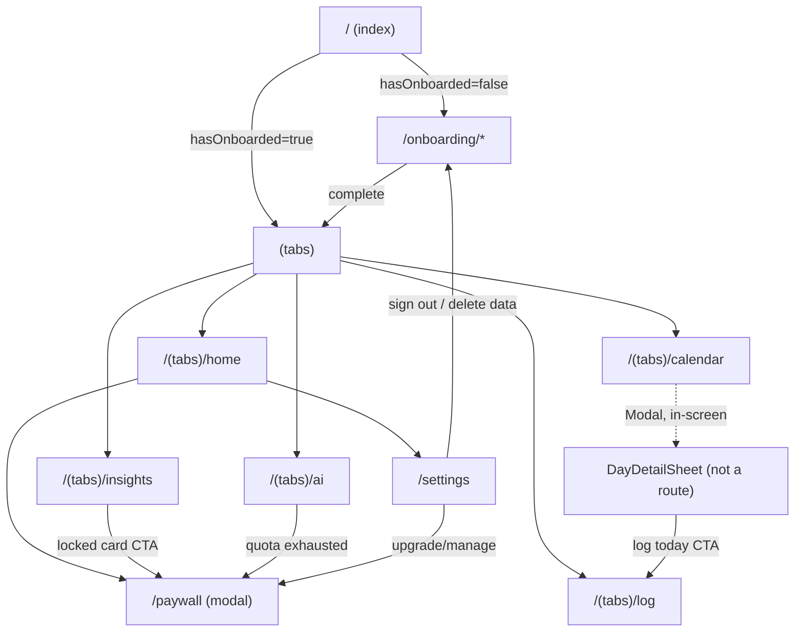

# 05 — Navigation Map

All findings **Confirmed from code**. Root `Stack` defined in `src/app/_layout.tsx:81-94`.

## Route Tree

```
Root (Stack, fade transitions)
├── index                     → Redirect to /onboarding or /(tabs)/home
├── onboarding (Stack, fade 180ms)
│   ├── index                 → Redirect to welcome
│   ├── welcome
│   ├── disclaimer
│   ├── cycle-basics          (step 1/4)
│   ├── goals                 (step 2/4)
│   ├── symptoms               (step 3/4)
│   └── account                (step 4/4)
├── (tabs)                    custom FloatingDock tab bar
│   ├── home
│   ├── log
│   ├── calendar
│   ├── insights
│   └── ai
├── settings                  (Stack, fade 150ms)
└── paywall                   (modal, fade_from_bottom 380ms)
```

## Route Table

| Route | File | Params | Entry points | Exit points | Deep-link reachable | Auth/premium gate |
|---|---|---|---|---|---|---|
| `/` | `src/app/index.tsx` | none | Cold start only | Immediate redirect | Yes (scheme `dialuna`) but always redirects | Branches on `hasOnboarded`, not a hard gate |
| `/onboarding/*` | `src/app/onboarding/*` | none typed | From `/` when `!hasOnboarded`; also Settings sign-out/delete (`router.replace('/onboarding')`) | `router.replace('/(tabs)/home')` on completion | Yes, but see index.tsx's own redirect at the true root | None |
| `/(tabs)/home` | `home.tsx` → `HomeScreen` | none | Post-onboarding replace; tab bar; back-nav from Settings/paywall | Settings (gear icon), `/(tabs)/ai`, `/(tabs)/log`, `/(tabs)/calendar`, `/(tabs)/insights`, `/paywall` via `PremiumBanner` (only if `!isPremium`) | Yes | Renders `null` if no profile |
| `/(tabs)/log` | `log.tsx` → `LogScreen` | none | Tab bar; Home quick action; `DayDetailSheet` "log today" (today only) | Stays on tab after save | Yes | None |
| `/(tabs)/calendar` | `calendar.tsx` → `CalendarScreen` | none | Tab bar; Home quick action | `DayDetailSheet` modal (in-screen, not a route) → CTA pushes `/(tabs)/log` | Yes | Renders `null` if no profile |
| `/(tabs)/insights` | `insights.tsx` → `InsightsScreen` | none | Tab bar; Home quick action | Locked-card CTA → `/paywall` | Yes | Per-card premium lock; requires `logCount >= 3` else `EmptyState` |
| `/(tabs)/ai` | `ai.tsx` → `AiChatScreen` | none | Tab bar; Home "Ask AI" buttons | Auto-redirect to `/paywall` when free daily cap exhausted | Yes | 3 free questions/day, unlimited premium |
| `/settings` | `settings.tsx` → `SettingsScreen` | none | Home gear icon | Back → `router.back()`; Sign out/Delete → `router.dismissAll()` + `/onboarding`; Upgrade/Manage → `/paywall` | Yes, `fade` stack screen (not modal) | Renders `null` if no profile |
| `/paywall` | `paywall.tsx` → `PaywallScreen` | none | Home banner, Insights locked cards, Settings upgrade, AI quota exhaustion | Close/back-swipe → `router.back()`; Subscribe → `purchase()` then `router.back()` | Yes, modal `fade_from_bottom` | This *is* the gate |

Tab bar (`src/app/(tabs)/_layout.tsx`) is a custom `FloatingDock` (`:27-109`) — 5 `Tabs.Screen`s registered at `:118-122`, no nested stacks inside tabs. `DayDetailSheet` is a React Native `Modal`, not a router route — opened/closed via local component state in `CalendarScreen`, so it is not independently deep-linkable.

## Navigation Tree Diagram



## Deep Linking

`app.json:9` sets `"scheme": "dialuna"`. No explicit `Linking` API usage, no custom deep-link handler, and no `linking` config override exists anywhere in the codebase (confirmed by grep) — the app relies entirely on Expo Router's default file-based deep linking. A `dialuna://onboarding/goals` link would land directly on the goals step with an **empty in-memory draft** (`goals: []`), since draft state is not derived from any persisted source. **Inferred edge case**, not explicitly guarded in code.

## Files reviewed
`src/app/_layout.tsx`, `index.tsx`, `(tabs)/_layout.tsx`, all tab route files, `onboarding/_layout.tsx`, `paywall.tsx`, `settings.tsx`, `app.json`.
