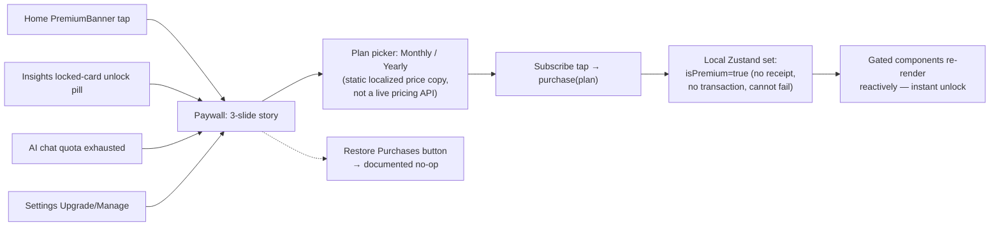

# 11 — Monetization, Analytics & Notification

All findings **Confirmed from code** unless tagged otherwise.

## 1. Monetization

### 1.1 Is there real IAP/RevenueCat? — **No, confirmed absent**
`package.json` contains no in-app-purchase or billing library: no `react-native-purchases` (RevenueCat), no `react-native-iap`, no `expo-in-app-purchases`, no Stripe SDK, and no network/HTTP client of any kind. The entire "purchase" flow is a local Zustand state mutation.

### 1.2 How premium state is set/read
- **Set**: `usePremiumStore.purchase(plan)` → `set({ isPremium: true, plan })` (`usePremiumStore.ts:42`). `togglePremiumDev()` (`:46-50`) flips it directly for dev/QA — **see risk register, this is shipped unconditionally in the visible Settings UI**. `reset()` clears it (`:51-57`, called by `resetAllData`).
- **Read**: `usePremiumStore((s) => s.isPremium)` in `HomeScreen.tsx:33`, `InsightsScreen.tsx:30`, `AiChatScreen.tsx:27`, `SettingsScreen.tsx:33`.
- **Persistence**: `AsyncStorage` key `dialuna.premium` — survives app restarts indefinitely, with **no expiry check, no periodic re-validation, and no renewal/cancellation handling** (there is nothing to renew or cancel against, since there's no real subscription).

### 1.3 Features gated by premium

| Feature | Gate | File:line |
|---|---|---|
| Home "Plan" (food/workout/self-care tips) vs. promo banner | `isPremium ? <PlanCard> : <PremiumBanner>` | `HomeScreen.tsx:199-212` |
| Insights: energy-by-phase bars | `withLock(..., !isPremium)` | `InsightsScreen.tsx:88-113` |
| Insights: PMS-vs-other sleep card | `withLock(..., !isPremium)` | `InsightsScreen.tsx:116-131` |
| Insights: next-PMS-window card | `withLock(..., !isPremium)` | `InsightsScreen.tsx:133-146` |
| Insights: top-symptoms card | `withLock(..., !isPremium)` | `InsightsScreen.tsx:148-167` |
| AI chat: daily question cap | `canAskAi()` = `isPremium \|\| usedToday() < 3` | `usePremiumStore.ts:34-35`, `useChat.ts:33-36` |
| AI chat header counter copy | `isPremium ? "unlimited" : "N remaining"` | `AiChatScreen.tsx:43-46` |

**Not gated**: cycle prediction (Home hero, Calendar), daily logging, log reflections, onboarding, settings.

### 1.4 Funnel Map

1. **Entry points** (real, wired): Home `PremiumBanner` (`HomeScreen.tsx:210`), Insights `LockedCard` unlock pill (`InsightsScreen.tsx:200`), AI chat quota exhaustion (`useChat.ts:34`), Settings Upgrade/Manage (`SettingsScreen.tsx:330`).
2. **Paywall UI**: 3-slide story (tap left/right, `step` 0-2), then plan selection (`step===3`) with Monthly/Yearly `PlanRow`s. Prices are static i18n string keys, not live store prices. `'lifetime'` exists as a `PremiumPlan` type value but has **no purchase UI path** (`PaywallScreen.tsx` locally narrows to `'monthly'|'yearly'`).
3. **"Purchase"** (`subscribe()`, `PaywallScreen.tsx:36-40`): `purchase(plan)` (pure local state set) → success haptic → `router.back()`. No payment sheet, no store transaction, no receipt, no loading/error state — it cannot fail.
4. **"Success"**: instantaneous, always succeeds; no network-failure handling, no pending state.
5. **Feature unlock**: immediate — gated components read `isPremium` reactively from the same store `purchase()` mutated. No polling/webhook/re-fetch needed.
6. **"Restore"**: `restore()` is a no-op (`usePremiumStore.ts:43-45`, comment: `// Mock: nothing to restore without a real store backend.`).

**Summary**: every step of the funnel is real *UI/UX* — real navigation, a fully animated paywall, real gating logic — wired to a **fully mocked backend**. There is no payment processor integration anywhere in this codebase as of this audit. This is explicitly self-documented in `src/i18n/en.json:448`.

### 1.5 Notable risk: unguarded dev premium toggle
`SettingsScreen.tsx:346-350` renders a switch labeled "Dev: premium override" (en) / "Dev: bật premium" (vi) that calls `togglePremiumDev()` directly. **Confirmed**: it is not wrapped in `if (__DEV__)` or any environment/feature-flag check in the files reviewed. If shipped unchanged to production, any user could self-grant premium status permanently (persisted to `AsyncStorage`) with a single tap, fully bypassing the paywall. Whether some higher-level build config strips it is **Unclear / requires confirmation** — no such stripping mechanism was found in `SettingsScreen.tsx`, `usePremiumStore.ts`, or `_layout.tsx`. See `14-risk-register.md` (Critical).

## 2. Analytics

**Confirmed absent.** Grepped all of `src/` and `package.json` for `analytics`, `Sentry`, `Amplitude`, `Mixpanel`, `PostHog`, `track(`, `logEvent` — no analytics SDK, no event tracking of any kind exists. The only incidental hits were false positives that confirm absence: `HomeScreen.tsx:165` uses `icon="analytics"` as a plain `@expo/vector-icons` icon name string, not a tracking call.

There is therefore no event inventory to report (no events fire anywhere), no naming-consistency issue, no PII risk from tracking, and no funnel/conversion instrumentation exists for the monetization funnel above.

## 3. Push Notification

**Confirmed absent as a working feature.** No `expo-notifications` package is installed, and no `Notifications.*` API usage exists anywhere in `src/`. Three notification-preference **toggles** exist in Settings (`notifPeriod`, `notifOvulation`, `notifDaily`, persisted in `useSettingsStore`), but they only store a boolean — there is no permission-request flow, no token registration, no foreground/background/killed-state handler, no scheduling logic, and no deep-link-from-notification handling anywhere in the codebase. A caption (`settings.notifDeferred`) next to these toggles in the Settings UI **Inferred** to signal this is a known, intentionally deferred feature rather than a bug.

## 4. External SDKs

| SDK | Purpose | Initialized where | Actually used? |
|---|---|---|---|
| expo-haptics | Tactile feedback | Called ad hoc across 9+ files | Yes, extensively |
| expo-blur / expo-glass-effect | Native blur/glass | `GlassSurface.tsx` | Yes, 3 call sites |
| expo-linear-gradient | Gradients | Theme-driven components (`BlobGlow`, `Chip`, `Screen`) | Yes |
| expo-localization | Device locale detection | `src/i18n/index.ts` | Yes |
| @expo-google-fonts/* | Custom fonts | `src/app/_layout.tsx` | Yes |
| expo-splash-screen | Native splash control | `src/app/_layout.tsx` | Yes |
| @react-native-async-storage/async-storage | Local persistence | All 4 persisted Zustand stores + i18n language key | Yes |
| expo-image, expo-device, expo-linking, expo-symbols, expo-system-ui, expo-web-browser, @expo/ui | Various Expo modules | Installed via `package.json` | **No `src/` usage found for any of these** — see `13-technical-debt.md` |
| Any analytics/crash/IAP/push SDK | — | — | **Not installed at all** |

No secrets/API keys were found or referenced anywhere in the reviewed code (consistent with there being no external network calls to authenticate).

## Files reviewed
`src/store/usePremiumStore.ts`, `src/types/premium.ts`, `src/components/paywall/PremiumBanner.tsx`, `src/features/paywall/PaywallScreen.tsx`, `src/features/settings/SettingsScreen.tsx`, `src/features/home/HomeScreen.tsx`, `src/features/insights/InsightsScreen.tsx`, `src/features/ai/useChat.ts`, `src/i18n/en.json`, `package.json`, full-repo grep for analytics/crash/notification/IAP identifiers.
