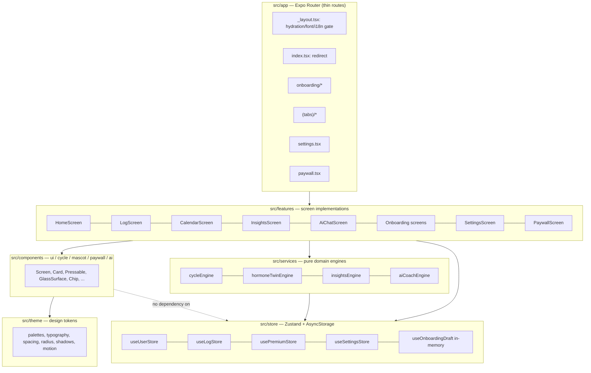
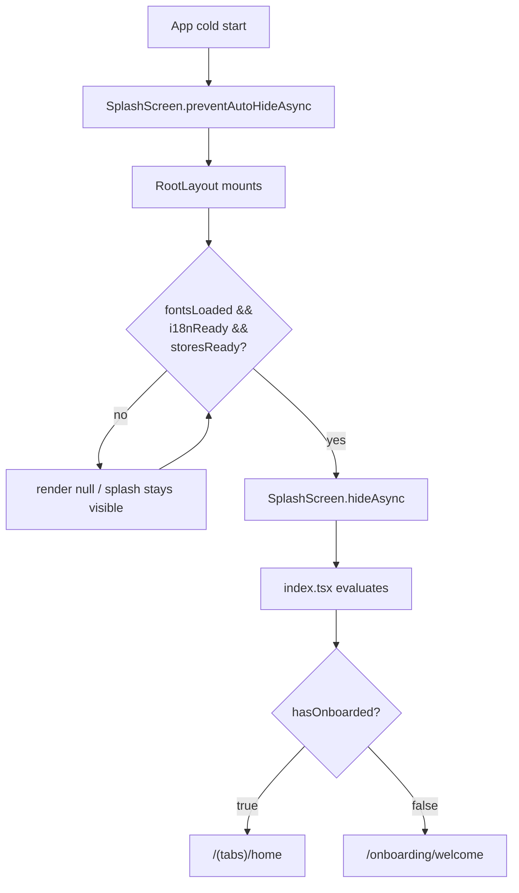
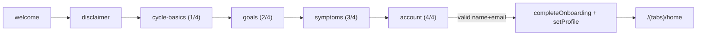
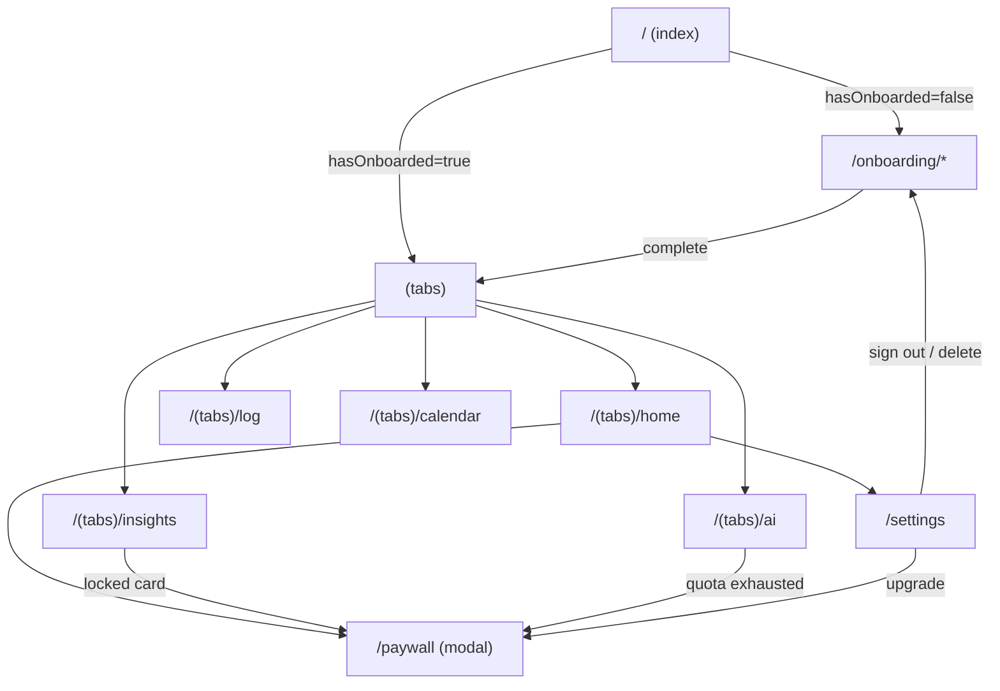
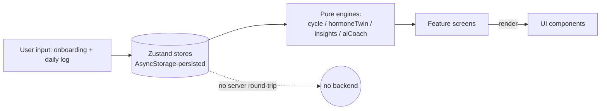
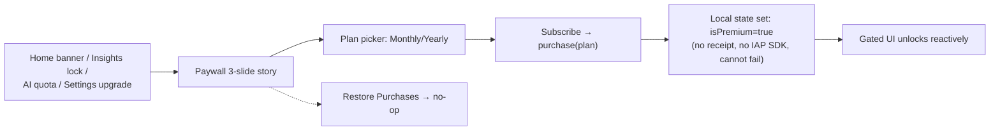
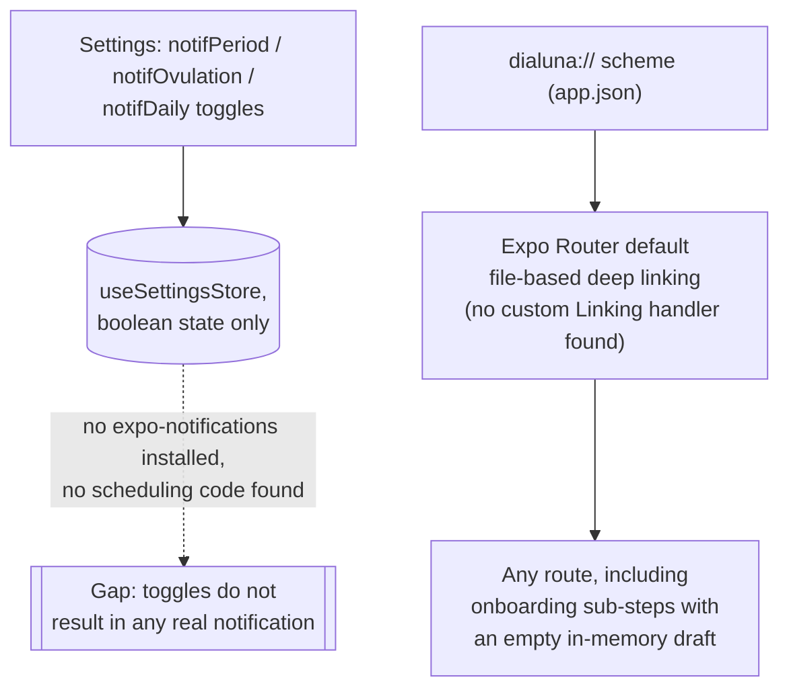
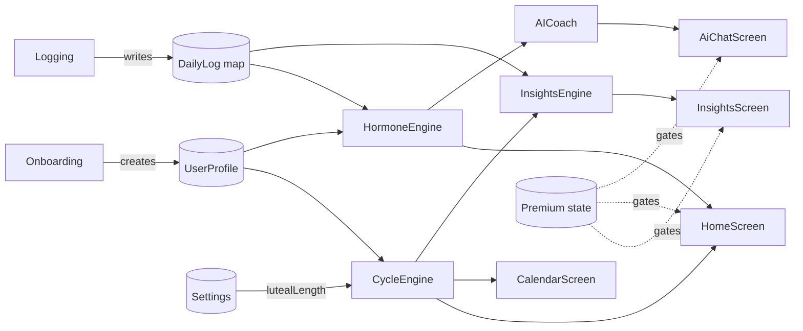
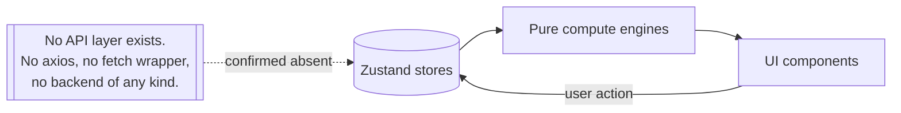

# Dialuna App Audit — Source of Truth

**Audit date**: 2026-07-14 · **Branch audited**: `feature/prototype-fidelity-motion` · **Method**: read-only, systematic review of the full `src/` tree (91 files, ~7,055 lines) plus config, assets, and git history. No production code was modified to produce this audit.

Every claim in this document set is tagged **Confirmed from code**, **Inferred from code**, or **Unclear / requires confirmation**, and cites a specific file (and usually a line number). Use this `README.md` as the entry point; each numbered document below goes deep on one area.

## What Dialuna is

A local-first Expo/React Native menstrual-cycle and hormone-wellness tracking app. No backend, no API, no authentication — a user completes onboarding once, and all cycle prediction, wellness scoring, insights, and AI-coach responses are computed on-device from data the user logs. Full detail: `00-executive-summary.md`.

## How it works (one paragraph)

App launch gates on font/i18n/store hydration, then redirects to onboarding or straight to the home tab based on a persisted `hasOnboarded` flag. Onboarding is a fixed 6-step wizard that builds a `UserProfile`, persisted via Zustand+AsyncStorage. From then on, five tabs (Home, Log, Calendar, Insights, AI) all read from that profile plus a locally-logged `DailyLog` history and run it through pure, unit-tested "engine" functions (`cycleEngine`, `hormoneTwinEngine`, `insightsEngine`, `aiCoachEngine`) to produce predictions, scores, and chat responses — nothing is fetched from a server. A paywall gates a handful of premium features; its purchase flow is a fully mocked local state mutation, not a real transaction.

## Main features
Cycle tracking & prediction · Hormone Twin daily wellness snapshot · Insights/analytics · AI Coach chat (keyword-template engine, not a real model) · Daily symptom/mood/level logging · Calendar with day-detail sheet · Onboarding wizard · Settings (profile, cycle config, notifications-UI-only, theme/language, data export stub, account reset) · Paywall (mocked purchases).

## Architecture overview



Full detail: `01-project-architecture.md`.

## App launch flow


Full detail: `04-user-flows.md`.

## Onboarding flow (there is no separate authentication system — see `04-user-flows.md` §2)


Full detail: `04-user-flows.md`.

## Main navigation tree


Full detail: `05-navigation-map.md`, screen-by-screen detail in `06-screen-inventory.md`.

## Data flow


Data is never sent anywhere off-device. Full detail: `09-state-data-api.md`.

## State management flow

```mermaid
flowchart TD
    Launch[App launch] --> Hydrate["useStoresHydrated():\npoll persist.hasHydrated() on\nuseUserStore, useLogStore,\nusePremiumStore, useSettingsStore"]
    Hydrate -->|all hydrated| Ready[App renders]
    Ready --> Read[Screens read via selectors,\ne.g. usePremiumStore(s => s.isPremium)]
    Ready --> Write[User actions call store actions,\ne.g. saveLog, purchase, updateProfile]
    Write --> Persist[Zustand persist middleware\nwrites to AsyncStorage]
    Persist -.no version/migrate configured.-> Risk[["Risk: schema changes\nhave no migration path"]]
```
Full detail: `09-state-data-api.md`, risk detail in `14-risk-register.md`.

## Subscription funnel


Full detail: `11-monetization-analytics-notification.md`.

## Notification / deep-link flow


Full detail: `11-monetization-analytics-notification.md` (notifications), `05-navigation-map.md` (deep links).

## Feature relationships


Full detail: `02-business-domain.md`.

## API → state → UI flow


Full detail: `09-state-data-api.md`.

## UI/UX style overview
A warm "lunar wellness" identity: a gold/amber accent ramp shared across light/dark themes, soft translucent `Card` surfaces over a 3-stop background gradient, restrained real glassmorphism (`GlassSurface`) in exactly 3 places, ambient `BlobGlow` motion, and an editorial Cormorant Garamond (serif) + Manrope (sans) type pairing. Full detail: `07-design-system-audit.md`.

## Current status
**Prototype / advanced-fidelity MVP.** See `00-executive-summary.md` and `15-recommended-next-steps.md` §13.1 for full reasoning.

## Top 10 issues
See `00-executive-summary.md` for the full list with citations. Highest priority: the unguarded dev premium toggle (Critical), the fully mocked payment backend (High), and the missing persisted-store migration strategy (High).

## Document index

| # | Document | Covers |
|---|---|---|
| 00 | [executive-summary.md](00-executive-summary.md) | Overview, current-state assessment, top 10 findings |
| 01 | [project-architecture.md](01-project-architecture.md) | Tech stack, technology map, folder architecture |
| 02 | [business-domain.md](02-business-domain.md) | Domain map (cycle, hormone twin, insights, AI coach, logging, premium, onboarding, settings) |
| 03 | [business-rules.md](03-business-rules.md) | Full business-rule/formula inventory + data model |
| 04 | [user-flows.md](04-user-flows.md) | App launch, auth (absent), onboarding, feature flows, edge cases |
| 05 | [navigation-map.md](05-navigation-map.md) | Full route table, navigation tree, deep linking |
| 06 | [screen-inventory.md](06-screen-inventory.md) | Screen-by-screen UX audit |
| 07 | [design-system-audit.md](07-design-system-audit.md) | Visual identity, color/typography/spacing/radius/shadow, component inventory, accessibility |
| 08 | [motion-interaction-audit.md](08-motion-interaction-audit.md) | Full animation/interaction inventory, motion-token adoption, risk patterns |
| 09 | [state-data-api.md](09-state-data-api.md) | State management, (absent) API layer, local storage keys, mock data |
| 10 | [assets-content-localization.md](10-assets-content-localization.md) | Asset inventory, app icon/splash, i18n parity, copy gaps |
| 11 | [monetization-analytics-notification.md](11-monetization-analytics-notification.md) | Monetization funnel, analytics (absent), notifications (absent), external SDKs |
| 12 | [feature-status-matrix.md](12-feature-status-matrix.md) | Every feature's UI/logic/API/persistence/error/analytics/test status |
| 13 | [technical-debt.md](13-technical-debt.md) | Code-quality findings with severity, plus what was checked and found clean |
| 14 | [risk-register.md](14-risk-register.md) | Product/business/UX risks by severity |
| 15 | [recommended-next-steps.md](15-recommended-next-steps.md) | Strongest/weakest parts, what to keep/change, phased roadmap |

## How this audit was produced
Five parallel read-only research passes (navigation/flows, business domain/data, design system, motion, assets/localization/tech-debt) each systematically read their assigned files, ran `tsc`/`eslint`/`vitest` where relevant, and cited every finding to a file and line. Findings were then cross-referenced and consolidated into the 16-document structure above. No source files under `src/`, `assets/`, or config were modified.
